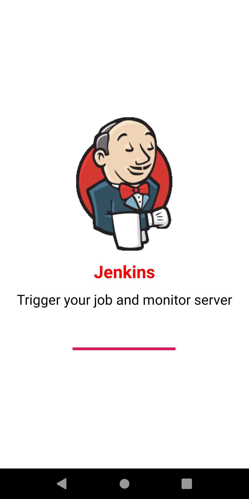
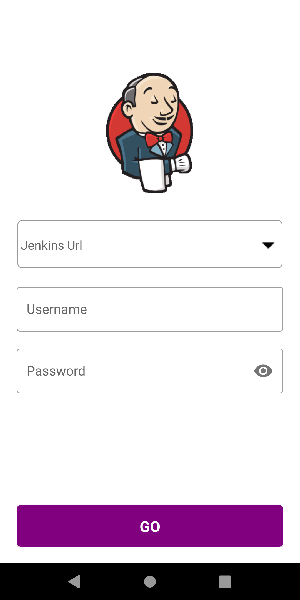

# Jenkins in your Pocket!

Are you a Android user? Do you like Android applications because they are easy to install, uninstall, start and stop?

Are you a Android user who likes Jenkins? Do you find Jenkins a bit hard to install, uninstall, start and stop? Then Jenkins.apk is for you.

</img>
</img>
</img>
</img>
</img>
</img>
